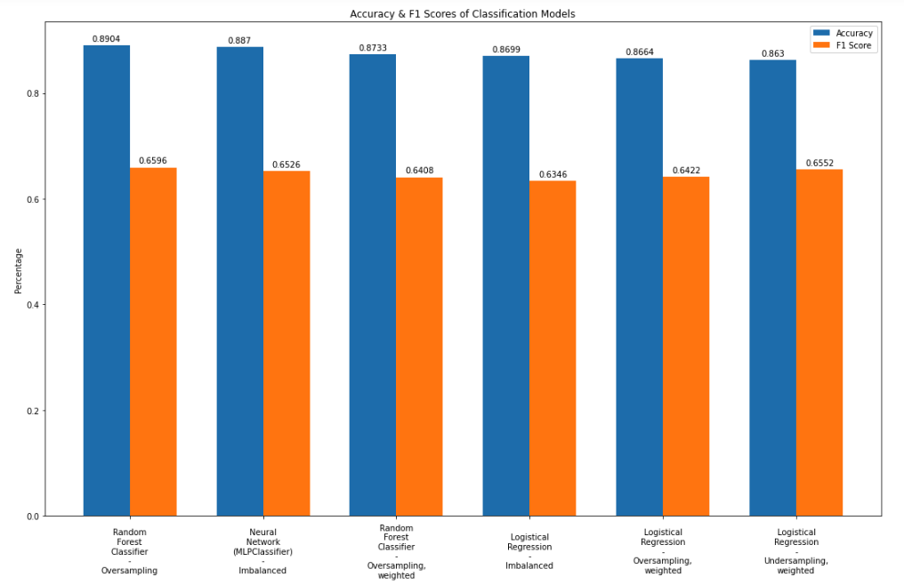

# Real-Estate-Sale-Type-Classification-Model

Based on the data provided in the Kaggle on-going competition "House Prices - Advanced Regression Techniques", the models below predict whether the conditon of sale of a home is normal or not normal. Logistical, random forest and neural network classifiers were compared. Because instances of the minority class (homes having non-normal sale conditions) was significantly less than instances of the majority class in this data set, oversampling and undersampling were used to create models where both minority and majority classification are as predictive as possible.

